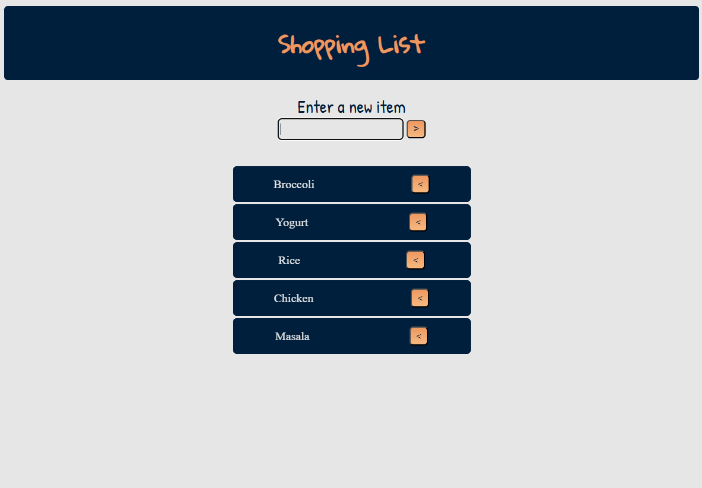
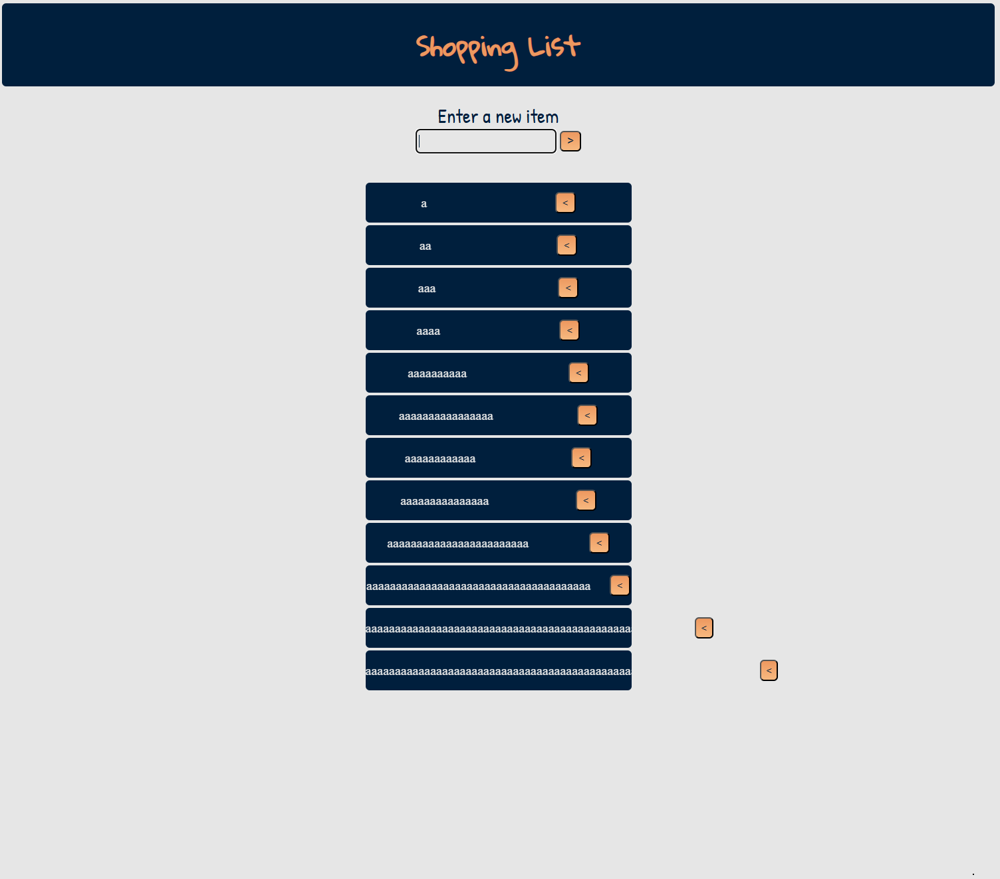

# Objective
Creating a shopping list with features to add and remove items Using DOM.

# Approach
 I chose it to be Modern with eye pleasing with same color scheme and informal tone.
 As it will only be used for personal obvious purposes.

# Difficulties 
Was easy until i have to deal with the intricacies of dom, the dom and it's methods sounds easy on paper. 
but, to deal with them are another thing for a first timer like me.

Don't get me wrong i am here coding and doing what i can but with the help from video tutorials and all. Still it was not as Plain and Simple as reading docs and building.
As they say I was "handheld" the whole time.

The main issue i was dealing with was how to refer to elements parents to delete the whole li from just clicking the delete button.

# Screenshots

## Demo
Works as usual

## Broken Style
Works unusually after the text is added and it exceed the size of the flex-box.
1. The text does not get buried under the flex-box. 
2. The text does not wrap.

This both effects can be done manually flex-box and overflow. but it does not look good.
so I chose to keep this simple. 
- the text can be mark can `...` after a certain char to maintain similar look across the whole app.

Broken Image

